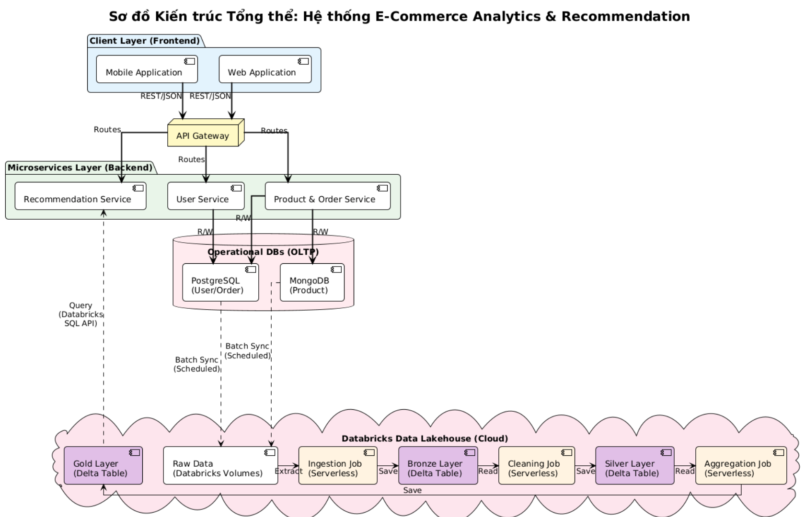

# E-commerce Data Analytics and Recommendation System

Project nay xay dung he thong thuong mai dien tu theo kien truc microservices ket hop Databricks Lakehouse (Bronze/Silver/Gold).

## Tong quan kien truc

- `user-service`: quan ly user, dang ky, dang nhap, JWT (PostgreSQL).
- `order-service`: quan ly product va order (MongoDB + PostgreSQL).
- `recommendation-service`: lay du lieu Gold tu Databricks SQL API, co fallback mock neu chua cau hinh Databricks.
- `api-gateway`: gom API ve 1 diem vao (`/api/users`, `/api/orders`, `/api/recommendations`).
- `frontend/web-app`: client web demo de test full luong.
- `frontend/mobile-app`: client mobile mock de test recommendation.
- `databricks_pipeline/01_Data_Pipeline_ETL.ipynb`: notebook ETL Bronze/Silver/Gold.

So do kien truc:



## Cau truc thu muc chinh

```text
backend/
	user-service/
	order-service/
	recommendation-service/
	api-gateway/
databricks_pipeline/
frontend/
	web-app/
	mobile-app/
docker-compose.yml
```

## Chay nhanh toan bo he thong

Yeu cau:

- Docker Desktop
- Da clone day du repository

Thuc hien:

bash:
cd "c:\Users\ACER\hocbai\ecommerce-recommendation\ecommerce-recommendation-main" && docker compose up --build

Port mac dinh:

- API Gateway: `http://localhost:3000`
- User service: `http://localhost:3001`
- Order service: `http://localhost:3002`
- Recommendation service: `http://localhost:3003`
- Web app: `http://localhost:8080`
- Mobile app mock: `http://localhost:8081`
- PostgreSQL: `localhost:5432`
- MongoDB: `localhost:27017`

## Cau hinh Databricks (tuy chon)

Neu khong cau hinh Databricks, recommendation-service van tra du lieu mock de demo.

Neu muon lay du lieu Gold that, set bien moi truong truoc khi chay compose:

- `DATABRICKS_HOST`
- `DATABRICKS_TOKEN`
- `DATABRICKS_WAREHOUSE_ID`

Vi du PowerShell:

```powershell
$env:DATABRICKS_HOST="adb-xxxx.azuredatabricks.net"
$env:DATABRICKS_TOKEN="dapi..."
$env:DATABRICKS_WAREHOUSE_ID="xxxx"
docker compose up --build
```

## API smoke test nhanh

Health:

```bash
curl http://localhost:3000/health
curl http://localhost:3001/health
curl http://localhost:3002/health
curl http://localhost:3003/health
```

Lay products qua gateway:

```bash
curl http://localhost:3000/api/orders/products
```

Top recommendations qua gateway:

```bash
curl "http://localhost:3000/api/recommendations/recommendations/top-products?limit=5"
```

## Ghi chu cho bao cao

- Bronze/Silver/Gold ETL da hoan thanh trong Databricks notebook.
- Backend da du 4 thanh phan theo so do: user, order, recommendation, gateway.
- Client layer da co 2 app de minh hoa luong web va mobile.
